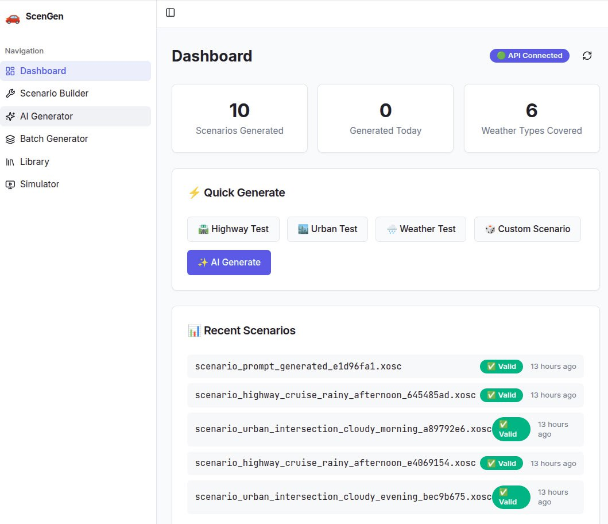
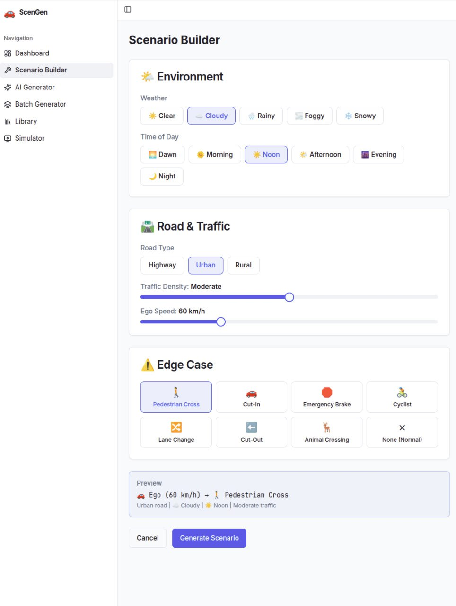
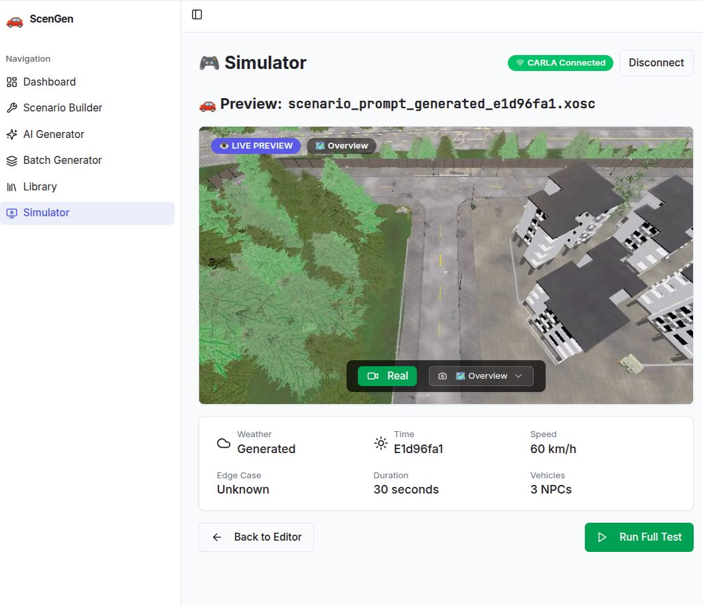

# 🚗 ScenGen — AI Traffic Scenario Generator

Generate [OpenSCENARIO](https://www.asam.net/standards/detail/openscenario/) files for ADAS/AD validation testing. Features a full-stack web interface, REST API, CLI tools, and optional CARLA simulator integration.


---

## 🎬 Demo Video

Watch a scenario running in CARLA with automated vehicle control:


> **[▶️ Download Full Video (MP4)](docs/assets/demo_video.mp4)** — 30-second scenario execution showing autonomous vehicle navigation in CARLA Town01.

---

## 📸 Screenshots

### Dashboard
*Overview of generated scenarios with quick actions and recent activity*



### Scenario Builder
*Configure weather, time of day, road type, traffic density, and edge cases*



### Simulator with Live Preview
*Execute scenarios in CARLA with real-time camera feed*



---

## ✨ Features

- **OpenSCENARIO 1.0 compliant** — Standard `.xosc` XML output
- **Full-stack web app** — React dashboard with scenario builder
- **AI-powered generation** — Natural language to scenario conversion
- **Batch generation** — Create test suites programmatically
- **CARLA integration** — Execute scenarios and collect metrics
- **Multiple interfaces** — Web UI, REST API, or CLI

### Scenario Parameters

| Category | Options |
|----------|---------|
| **Weather** | Clear, Cloudy, Rainy, Foggy, Snowy |
| **Time of Day** | Dawn, Morning, Noon, Afternoon, Evening, Night |
| **Traffic Density** | Empty → Sparse → Moderate → Dense → Rush Hour |
| **Edge Cases** | Pedestrian crossing, Cut-in/out, Emergency brake, Lane change, Cyclist, Animal crossing, Intersection |

---

## 💻 System Requirements

### Minimum Requirements

| Component | Requirement |
|-----------|-------------|
| **OS** | Linux (Ubuntu 22.04+ recommended) |
| **CPU** | 4 cores, 2.5 GHz+ |
| **RAM** | 8 GB (16 GB+ recommended for CARLA) |
| **GPU** | NVIDIA GPU with 4 GB+ VRAM (for CARLA) |
| **Disk** | 15 GB free space (with CARLA) |
| **Python** | 3.10+ |
| **Node.js** | 18+ |

### CARLA Requirements

CARLA simulator is optional but recommended for scenario execution:

| Component | Requirement |
|-----------|-------------|
| **CARLA Version** | 0.9.13+ |
| **GPU Driver** | NVIDIA 470+ or Vulkan 1.1 compatible |
| **VRAM** | 4 GB minimum, 6 GB+ recommended |

> **Note:** Without CARLA, the system runs in mock mode — scenarios are generated and validated but not executed in simulation.

### Tested System

This project has been developed and tested on:

| Component | Specification |
|-----------|---------------|
| **OS** | Ubuntu 24.04.4 LTS (Noble Numbat) |
| **Kernel** | 6.17.0-19-generic |
| **CPU** | AMD Ryzen 9 5900HX (8 cores / 16 threads) |
| **GPU** | NVIDIA GeForce RTX 3060 Laptop (6 GB VRAM) |
| **RAM** | 24 GB DDR4 |
| **CARLA** | 0.9.13 |

### Platform Support

| Platform | Status | Notes |
|----------|--------|-------|
| **Ubuntu 22.04+** | ✅ Fully supported | Primary development platform |
| **Ubuntu 20.04** | ✅ Supported | May need Python 3.10 PPA |
| **Debian 12+** | ⚠️ Should work | Not officially tested |
| **Windows 10/11** | ⚠️ Partial | WSL2 recommended; native CARLA available |
| **macOS** | ❌ Limited | No CARLA support; API/frontend only |

---

## 🚀 Quick Start

### Option 1: Full Stack (Recommended)

```bash
cd ~/clawd/projects/scenario-generator

# Start everything (API + Frontend + CARLA if available)
./start.sh

# Or without CARLA
./start.sh --no-carla
```

**Services:**
| Service | URL | Description |
|---------|-----|-------------|
| Frontend | http://localhost:8080 | Web dashboard |
| API | http://localhost:8000 | REST endpoints |
| CARLA | localhost:2000 | Simulator (optional) |

**Stop all services:**
```bash
./stop.sh
```

**Restart all services:**
```bash
./restart.sh

# Or without CARLA
./restart.sh --no-carla
```

### Option 2: CLI Only

```bash
cd ~/clawd/projects/scenario-generator
source venv/bin/activate

# Generate a scenario
python cli.py generate

# Generate from natural language
python cli.py from-prompt "Rainy night highway with emergency braking at 100 km/h"
```

---

## 📦 Installation

### Prerequisites
- Python 3.10+
- Node.js 18+ (for frontend)
- CARLA Simulator 0.9.13+ (optional)

### Backend Setup

```bash
cd ~/clawd/projects/scenario-generator

# Create virtual environment
python3 -m venv venv
source venv/bin/activate

# Install dependencies
pip install -r requirements.txt
```

### Frontend Setup

```bash
cd frontend

# Install dependencies
npm install

# Development server
npm run dev
```

### CARLA Setup (Optional)

```bash
# Install CARLA Python package
pip install carla

# Set CARLA root (if not /opt/carla)
export CARLA_ROOT=/path/to/carla

# CARLA will start automatically with ./start.sh
```

---

## 🖥️ Web Interface

The React frontend provides a full-featured dashboard:

### Pages

| Page | Description |
|------|-------------|
| **Dashboard** | Overview stats, recent scenarios, quick actions |
| **Scenario Builder** | Manual parameter configuration with preview |
| **AI Generator** | Natural language scenario creation |
| **Batch Generator** | Generate multiple scenarios with templates |
| **Library** | Browse, search, and manage scenarios |
| **Simulator** | Run scenarios in CARLA with live preview |

### Tech Stack

- React 18 + TypeScript
- Vite (build tool)
- Tailwind CSS
- shadcn/ui components
- TanStack Query (data fetching)
- Recharts (visualizations)

---

## 🔌 REST API

Base URL: `http://localhost:8000`

### Endpoints

| Method | Endpoint | Description |
|--------|----------|-------------|
| `GET` | `/` | Health check |
| `GET` | `/api/stats` | Dashboard statistics |
| `POST` | `/api/generate` | Generate single scenario |
| `POST` | `/api/generate/ai` | Generate from natural language |
| `POST` | `/api/generate/batch` | Generate multiple scenarios |
| `GET` | `/api/scenarios` | List all scenarios |
| `GET` | `/api/scenarios/{id}` | Get scenario details |
| `GET` | `/api/scenarios/{id}/download` | Download .xosc file |
| `GET` | `/api/scenarios/{id}/video` | Download recorded video |
| `GET` | `/api/scenarios/{id}/video/status` | Check video availability |
| `DELETE` | `/api/scenarios/{id}` | Delete scenario |

### Example: Generate Scenario

```bash
curl -X POST http://localhost:8000/api/generate \
  -H "Content-Type: application/json" \
  -d '{
    "weather": "rainy",
    "time_of_day": "night",
    "road_type": "highway",
    "edge_case": "ebrake",
    "traffic_density": 60,
    "ego_speed": 100
  }'
```

### Example: AI Generation

```bash
curl -X POST http://localhost:8000/api/generate/ai \
  -H "Content-Type: application/json" \
  -d '{
    "prompt": "Urban intersection at dusk with a cyclist crossing"
  }'
```

### Example: Batch Generation

```bash
curl -X POST http://localhost:8000/api/generate/batch \
  -H "Content-Type: application/json" \
  -d '{
    "count": 20,
    "include_all_weather": true,
    "include_all_edge_cases": true
  }'
```

---

## 💻 CLI Commands

```bash
source venv/bin/activate
python cli.py [command] [options]
```

| Command | Description |
|---------|-------------|
| `generate` | Generate OpenSCENARIO files |
| `from-prompt` | Generate from natural language |
| `edge-cases` | Generate comprehensive edge case suite |
| `templates` | List available scenario templates |
| `options` | Show all available generation options |
| `validate` | Validate an OpenSCENARIO file |

### Examples

```bash
# Generate with specific parameters
python cli.py generate --weather foggy --time night --edge-case pedestrian_crossing

# Generate 10 scenarios
python cli.py generate --count 10

# Natural language generation
python cli.py from-prompt "Highway cruise at 120 km/h with sudden cut-in"

# Generate all edge case scenarios
python cli.py edge-cases

# Validate a file
python cli.py validate scenarios/my_scenario.xosc
```

---

## 🎮 CARLA Integration

### Running Scenarios

```python
from carla_integration import CarlaScenarioRunner

runner = CarlaScenarioRunner()
runner.connect()

# Run single scenario
result = runner.run_scenario("scenarios/highway_rainy_night.xosc")
print(f"Success: {result.success}")
print(f"Collisions: {result.collision_count}")
print(f"Distance: {result.distance_traveled}m")

# Batch run with report
results = runner.run_batch("scenarios/")
runner.generate_report(results, "test_report.json")
```

### Video Recording

Scenarios are automatically recorded during execution:

- **Frames captured** at 30 FPS from chase camera
- **Encoded to MP4** with H.264 when scenario completes
- **Download via API** or web interface

```bash
# Check if video exists
curl http://localhost:8000/api/scenarios/{scenario_id}/video/status

# Download video
curl -O http://localhost:8000/api/scenarios/{scenario_id}/video
```

Videos are stored in `recordings/` directory.

### Metrics Collected

| Metric | Description |
|--------|-------------|
| `collision_count` | Number of collisions during scenario |
| `lane_invasion_count` | Lane boundary violations |
| `traffic_light_violations` | Red light infractions |
| `distance_traveled` | Total distance in meters |
| `average_speed` | Mean velocity in km/h |
| `min_ttc` | Minimum time-to-collision (safety metric) |

### Mock Mode

Without CARLA installed, the system runs in mock mode — scenarios are generated and validated but not executed.

---

## 📁 Project Structure

```
scenario-generator/
├── cli.py                    # Command-line interface
├── api.py                    # FastAPI REST server
├── scenario_generator.py     # Core OpenSCENARIO generator
├── ai_generator.py          # AI-powered parameter selection
├── requirements.txt         # Python dependencies
├── start.sh                 # Start all services
├── stop.sh                  # Stop all services
├── restart.sh               # Restart all services
│
├── frontend/                # React web application
│   ├── src/
│   │   ├── components/      # UI components
│   │   ├── pages/           # Route pages
│   │   └── lib/             # Utilities
│   ├── package.json
│   └── vite.config.ts
│
├── carla_integration/       # CARLA simulator integration
│   └── runner.py           # Scenario execution & metrics
│
├── scenarios/              # Generated .xosc files
├── templates/              # Scenario templates
└── logs/                   # Service logs
```

---

## 🎯 Scenario Templates

| Template | Description | Speed Range |
|----------|-------------|-------------|
| `highway_cruise` | Highway with varying traffic | 80-130 km/h |
| `urban_intersection` | Urban scenarios with pedestrians | 30-50 km/h |
| `adverse_weather` | Driving in rain/fog/snow | 30-70 km/h |
| `night_driving` | Reduced visibility scenarios | 40-80 km/h |
| `emergency_response` | Emergency braking tests | 40-80 km/h |

---

## 📄 Output Format

Generated files follow OpenSCENARIO 1.0 standard:

```xml
<?xml version="1.0" encoding="UTF-8"?>
<OpenSCENARIO xmlns="http://www.asam.net/OpenSCENARIO/1.0">
  <FileHeader revMajor="1" revMinor="0" date="..." description="..." author="ScenGen"/>
  <ParameterDeclarations/>
  <CatalogLocations>...</CatalogLocations>
  <RoadNetwork>
    <LogicFile filepath="..."/>
  </RoadNetwork>
  <Entities>
    <ScenarioObject name="Ego">...</ScenarioObject>
    <ScenarioObject name="NPC_1">...</ScenarioObject>
  </Entities>
  <Storyboard>
    <Init>...</Init>
    <Story>...</Story>
    <StopTrigger>...</StopTrigger>
  </Storyboard>
</OpenSCENARIO>
```

---

## 🧪 Development

### Run Tests

```bash
# Backend tests
source venv/bin/activate
pytest

# Frontend tests
cd frontend
npm run test
```

### API Documentation

With the API running, visit:
- Swagger UI: http://localhost:8000/docs
- ReDoc: http://localhost:8000/redoc

### Logs

```bash
# View API logs
tail -f logs/api.log

# View frontend logs
tail -f logs/frontend.log

# View CARLA logs
tail -f logs/carla.log
```

---

## 📝 License

MIT

## 👤 Author

**Vineeth Kumar**
- GitHub: [@VineethKumar7](https://github.com/VineethKumar7)
- LinkedIn: [vineethkumar7](https://linkedin.com/in/vineethkumar7)
